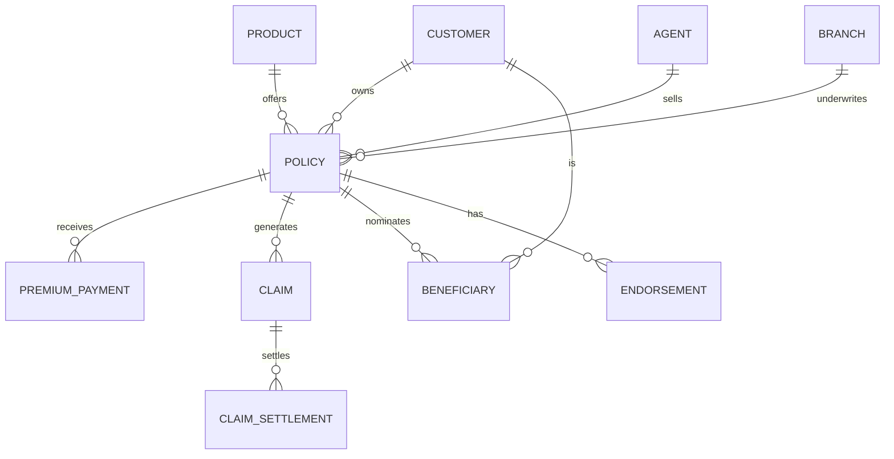

# Data Model

## 1. Scope and Assumptions

The model is intended to support the platform’s medallion architecture:

- Bronze layer: raw operational data from policy, claims, billing, CRM, and third-party systems
- Silver layer: cleaned and standardized business entities
- Gold layer: curated analytics tables for dashboards and reporting

The model assumes a Kenyan operating context with:

- Kenyan Shilling (KES) as the default currency
- Customer identifiers such as National ID or Passport number
- Kenyan counties and towns for locality-based reporting
- Mobile money and bank payments as common premium channels
- Insurance products such as motor, medical, life, fire, and travel

## 2. Core Business Entities

The following domain entities form the foundation of the model:

- Customer / Policyholder
- Product / Cover
- Policy
- Premium Payment
- Claim
- Claim Settlement
- Agent / Broker
- Branch / Region
- Beneficiary
- Endorsement / Adjustment

## 3. Conceptual Entity Relationship Model

## 4. Logical Data Model

### 4.1 Customer Dimension

Table: customer

| Column | Type | Description |
|---|---|---|
| customer_sk | bigint | Surrogate key |
| customer_id | varchar | Business key from source system |
| national_id | varchar | Kenyan national ID if available |
| passport_number | varchar | Passport number if applicable |
| first_name | varchar | Customer first name |
| last_name | varchar | Customer last name |
| phone_number | varchar | Primary phone |
| email | varchar | Email address |
| date_of_birth | date | Date of birth |
| gender | varchar | Male, Female, Other |
| marital_status | varchar | Single, Married, Widowed |
| county | varchar | Kenyan county |
| town | varchar | Town or locality |
| customer_segment | varchar | Individual, SME, Corporate |
| created_at | timestamp | Record creation date |

### 4.2 Product Dimension

Table: product

| Column | Type | Description |
|---|---|---|
| product_sk | bigint | Surrogate key |
| product_id | varchar | Business key |
| product_code | varchar | Product code |
| product_name | varchar | Name of the product |
| product_type | varchar | Motor, Medical, Life, Fire, Travel |
| currency | varchar | Default currency, usually KES |
| sum_assured_unit | varchar | Amount unit or coverage basis |
| is_active | boolean | Whether the product is active |

### 4.3 Agent Dimension

Table: agent

| Column | Type | Description |
|---|---|---|
| agent_sk | bigint | Surrogate key |
| agent_id | varchar | Business key |
| agent_code | varchar | Agent reference code |
| full_name | varchar | Agent full name |
| license_number | varchar | Licensing number |
| phone_number | varchar | Contact number |
| branch_id | varchar | Branch association |
| commission_rate | decimal | Agent commission rate |
| is_active | boolean | Active status |

### 4.4 Branch / Region Dimension

Table: branch

| Column | Type | Description |
|---|---|---|
| branch_sk | bigint | Surrogate key |
| branch_id | varchar | Business key |
| branch_name | varchar | Branch name |
| county | varchar | County location |
| region | varchar | Regional grouping |
| is_active | boolean | Active status |

### 4.5 Policy Fact / Dimension Table

Table: policy

| Column | Type | Description |
|---|---|---|
| policy_sk | bigint | Surrogate key |
| policy_id | varchar | Business key |
| policy_number | varchar | Policy number |
| customer_sk | bigint | Customer dimension key |
| product_sk | bigint | Product dimension key |
| agent_sk | bigint | Agent dimension key |
| branch_sk | bigint | Branch dimension key |
| issue_date | date | Policy start date |
| expiry_date | date | Policy expiry date |
| status | varchar | Active, Cancelled, Expired, Pending |
| premium_amount | decimal | Annual or periodic premium |
| sum_assured | decimal | Total insured value |
| currency | varchar | Currency code |
| renewal_count | int | Number of renewals |
| created_at | timestamp | Record creation time |

### 4.6 Premium Payment Fact Table

Table: payment

| Column | Type | Description |
|---|---|---|
| payment_sk | bigint | Surrogate key |
| payment_id | varchar | Business key |
| policy_sk | bigint | Related policy |
| payment_date | date | Payment date |
| amount | decimal | Amount received |
| payment_method | varchar | Bank, M-Pesa, Cash, Card |
| payment_channel | varchar | Online, Branch, Agent, Mobile |
| receipt_number | varchar | Payment receipt number |
| status | varchar | Successful, Pending, Failed |
| currency | varchar | Currency code |

### 4.7 Claim Fact Table

Table: claim

| Column | Type | Description |
|---|---|---|
| claim_sk | bigint | Surrogate key |
| claim_id | varchar | Business key |
| policy_sk | bigint | Related policy |
| claim_date | date | Date the claim was reported |
| loss_date | date | Date of incident |
| claim_type | varchar | Theft, Accident, Medical, Fire, etc. |
| claim_status | varchar | Open, Pending, Approved, Rejected, Settled |
| claim_amount | decimal | Amount claimed |
| reserve_amount | decimal | Reserve amount set |
| settlement_amount | decimal | Final amount paid |
| cause_of_loss | varchar | Cause description |
| fraud_flag | boolean | Fraud indicator |
| created_at | timestamp | Record creation time |

### 4.8 Claim Settlement Fact Table

Table: claim_settlement

| Column | Type | Description |
|---|---|---|
| settlement_sk | bigint | Surrogate key |
| claim_sk | bigint | Claim key |
| settlement_date | date | Settlement date |
| paid_amount | decimal | Amount paid |
| payment_method | varchar | Bank, M-Pesa, Cheque |
| settlement_status | varchar | Paid, Partial, Rejected |
| approved_by | varchar | User or approver name |

### 4.9 Beneficiary Dimension

Table: beneficiary

| Column | Type | Description |
|---|---|---|
| beneficiary_sk | bigint | Surrogate key |
| beneficiary_id | varchar | Business key |
| policy_sk | bigint | Related policy |
| beneficiary_name | varchar | Name of beneficiary |
| relationship | varchar | Spouse, Child, Parent, Other |
| share_percentage | decimal | Share of payout |
| phone_number | varchar | Contact number |
| is_primary | boolean | Whether this is the primary beneficiary |

### 4.10 Endorsement / Policy Change Table

Table: policy_endorsement

| Column | Type | Description |
|---|---|---|
| endorsement_sk | bigint | Surrogate key |
| policy_sk | bigint | Related policy |
| endorsement_date | date | Date action was made |
| change_type | varchar | Upgrade, Downgrade, Add Cover, Change Beneficiary |
| old_value | varchar | Previous value |
| new_value | varchar | New value |
| approved_by | varchar | User or approver |

## 5. Gold Layer Marts

- mart_policy
  - Policy counts, active policies, renewals, lapses, premium trends
- mart_claim
  - Claims frequency, loss ratio, average settlement time, severity by product or region
- mart_customer
  - Customer growth, retention, segments, and policy penetration
- mart_finance
  - Gross written premium, earned premium, incurred claims, combined ratio
- mart_sales
  - Premium by agent, commission, branch performance, conversion rates

## 6. Data Quality Rules

The model should enforce the following quality rules:

- Policy number must be unique
- Claim number must be unique
- Premium payment amount must be greater than zero
- Claim settlement amount must not exceed claim amount
- Customer references must be valid for every policy
- Every claim must reference an existing policy
- Dates must be consistent, with claim dates not earlier than policy issue dates
